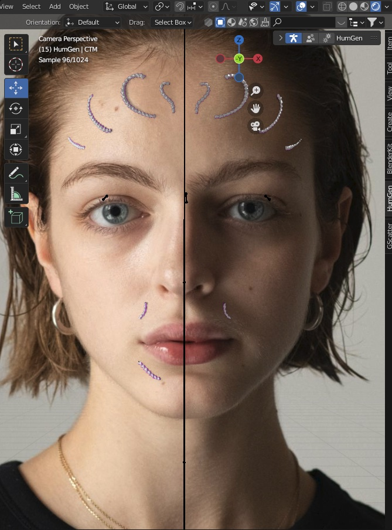
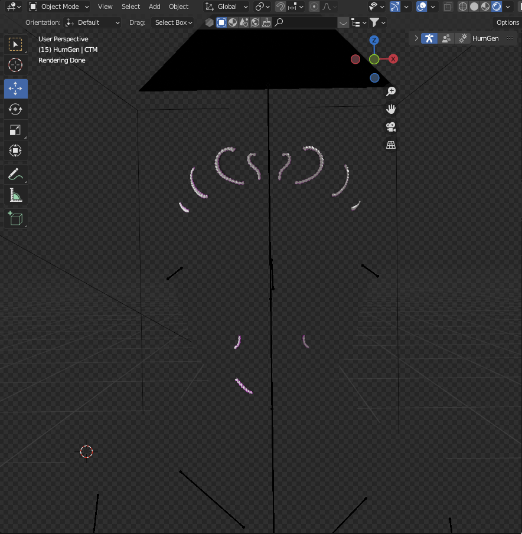
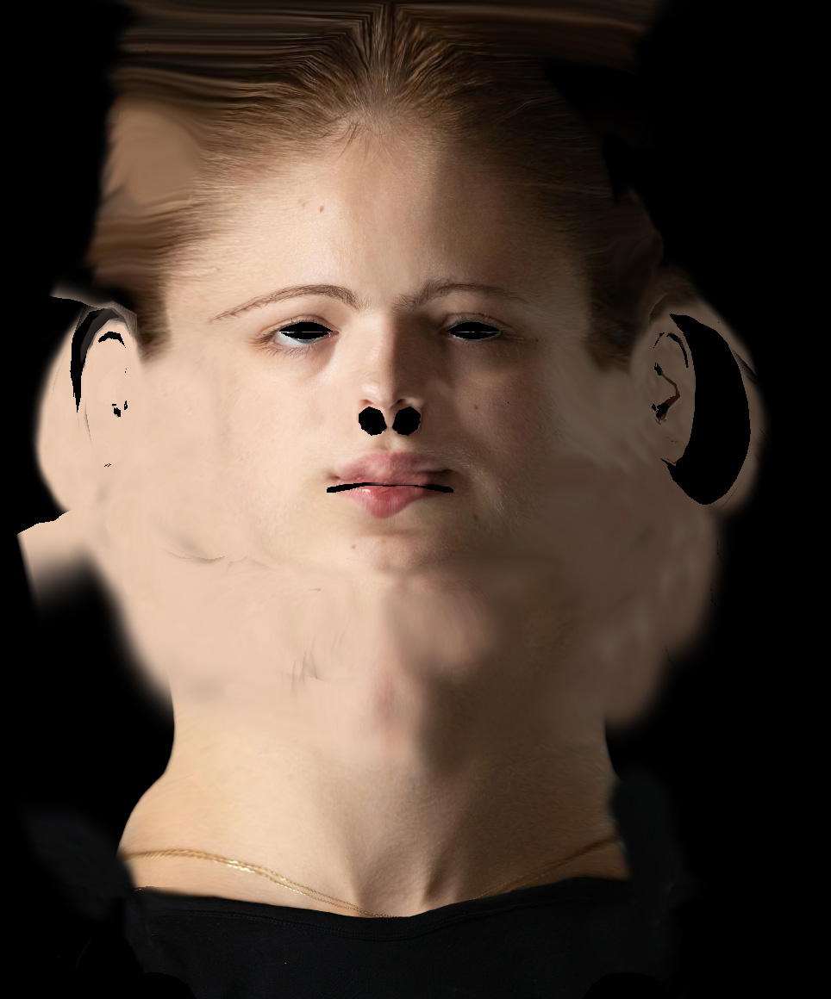

## Case study: Human-03

This is a case study on some of the "intricacies" of this image:

### Intro

First, i would like to break down the "layers" this scene has.
From front to back:

<ol start="0">
  <li>Camera</li>
  <li>Mask</li>
  <li>A textured 3D human model</li>
</ol>

The camera plays a vital part in setting up the scene to achieve this exact look.

### The process

In this image without any edits, you can see the 3D elements being cast onto the 2D image with nice, soft shadows that would be very hard and/or time consuming to achieve with Photoshop.

The secret lies here: The textured 3D model is hidden and is assigned a attribute called "Shadow catcher". This means that the object is hidden to the camera, but it can interact with other objects in the scene.

Then, to nail the correct look, reflections and overall colors of the metal a texture is created for the hidden 3D object, as light bounces off of every object in the scene.

The last part was done in Photoshop, where i fixed some of the details and tuned the colors of the image to my final liking and finished it all off with some typography.

### Recap

- Length: About a day for the render itself. The know-how took about a week and a test project to fully understand and get comfortable with.
- Software used: Blender, Cycles render, Adobe Photoshop
- Fun: A lot
