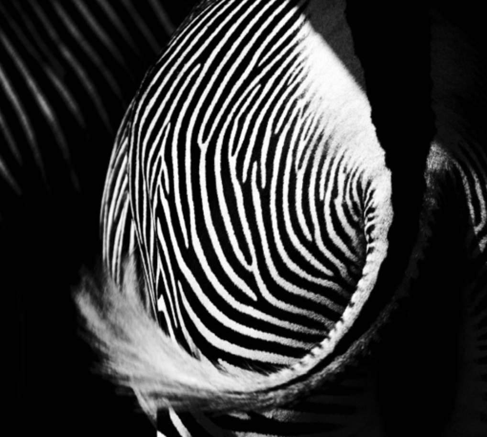
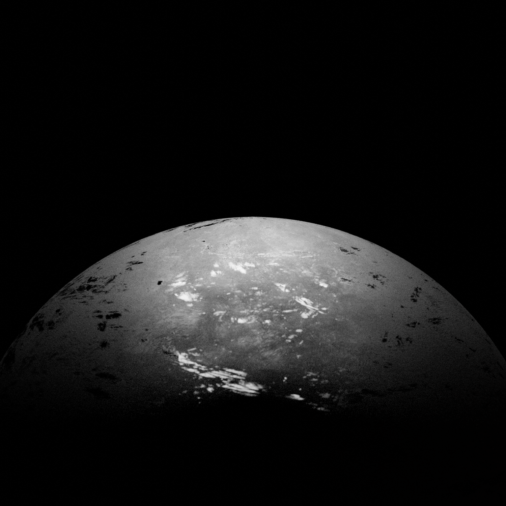
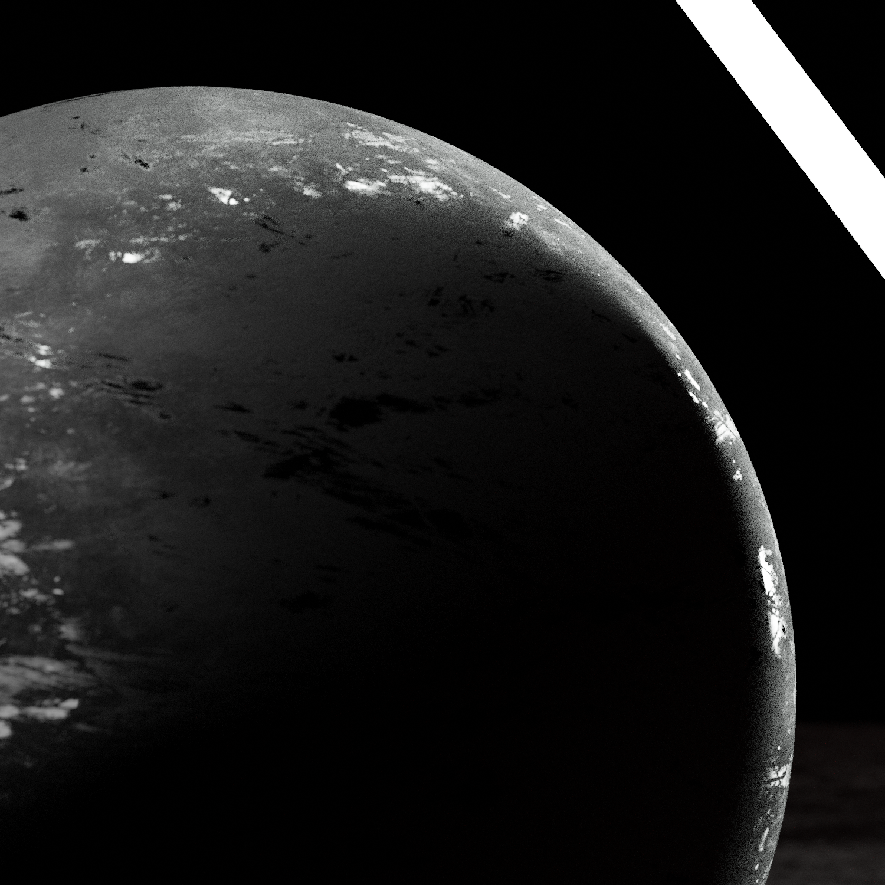

# The guide to: Making less boring renders (The importance of light & shadows)

by Max Měšťan

- Download the slides [here](images/mestan-slides.pdf)
- View my thought process [here](process.md)

## Contents

01: [Basic contrast things](#contrast)
02: [How does light work?](#light)
03: [Some examples](#examples)

### Basic contrast things 

This b&w image of a zebra's behind is a very nice example of properly utilized contrast in a image. You can clearly see the texture of the zebra's fur and there are other zebras hidden in the shadows adding depth to the image, which allows the main subject of the image to stand out and its shape is clearly defined.

### How does light work? (in Blender) 

I failed all of my physics exams in middle school, so i won't be able to describe the exact way how photons flow in the real world. What i can however tell you, is three key points on how light works in Blender.

If you are familiar with product photography, these basics won't be new to you, but i still think it's important to have them written down.

a.) Light further away from the object = dimmer shadows
b.) Making the light larger = softer shadow
c.) Stronger light (more watts) = stronger edges of the object

You can combine these three basics to get a nice looking light setup in Blender. I personally use two to three separate area lights for one object, along with one glowing cylinder to modify the end result a bit.

### Some examples 

During my presentation i did a live demo of a Blender file, where i set up four different examples of how proper light setup can transform the look of a scene. You can look at these below, along with some small comments by yours truly.

This first render is the starting point. It's a sphere with a texture applied to it and a fill light just above it. Notice the different style of illumination around the edges and in the center. But we can do better.

This is still the same sphere as from our starting point. This time, the fill light is coming in from the side, splitting the sphere in two sides - a lit one and a unlit one. I added a key light on the side (the previously mentioned glowing cylinder), which helps me to really accentuate the edges of the sphere. This can be done with any object and just these two lights.

Now we get into the good stuff. We have two fill lights and one key light, the difference here being mainly in the model. No longer are we using a sphere, but instead i opted to use a traffic cone. You can really see how the light can make the dirt particles shine and how differently the light interacts with the rough metal base and the much smoother plastic upper part.

This final render is just a little bonus and a demonstration of what you can do with lights that are of separate color. For this example i used a much more detailed model and a red key light coming in from the top, giving the render a distinct Sci-Fi look that is pretty simple to reproduce.

If you really want to go in-depth and explore, feel free to download the .blend file [here](images/lighting.blend).
