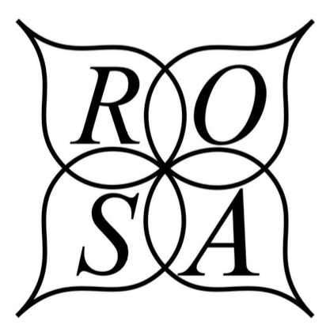
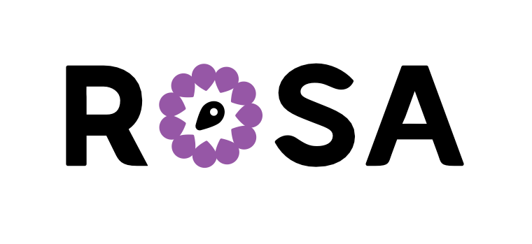
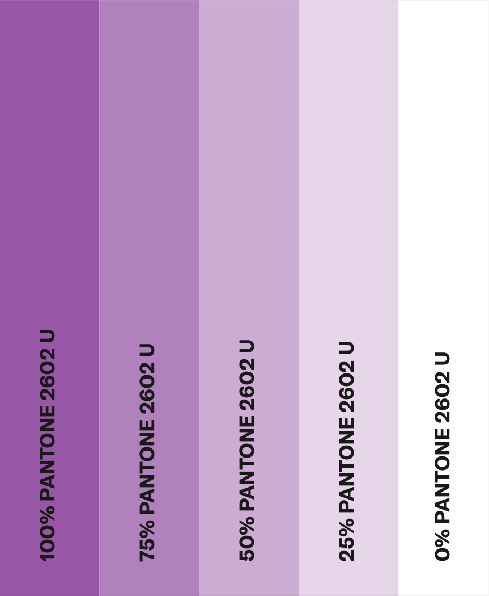
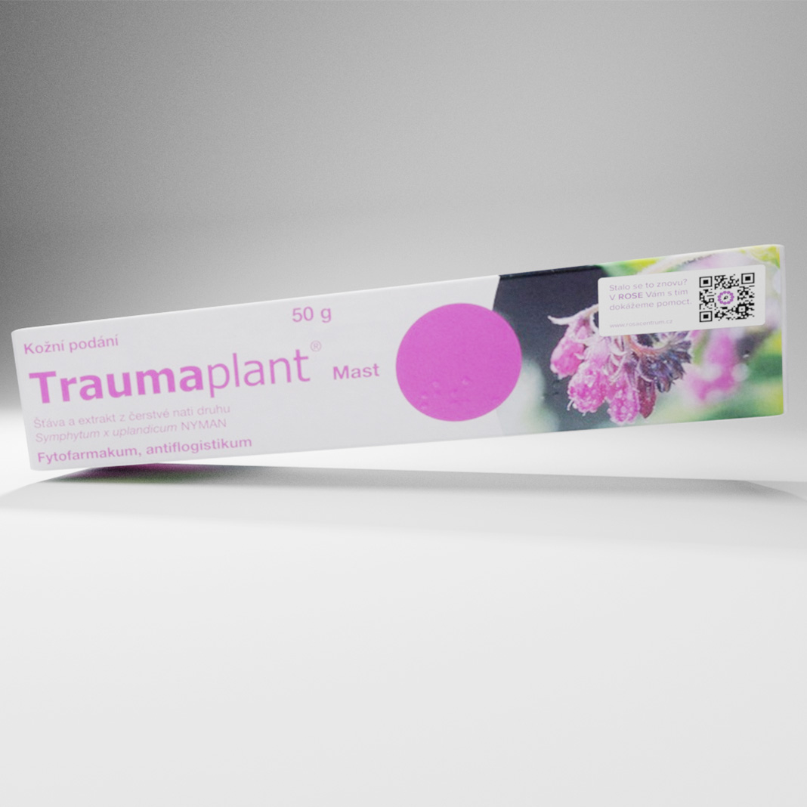
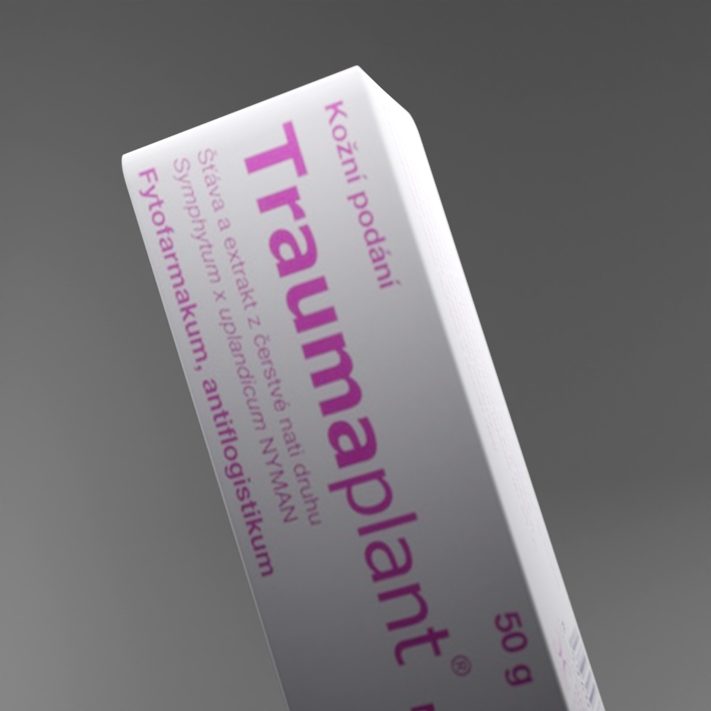

# Visual identity for a non-profit organization: the final presentation

by Max Měšťan

- Download the slides [here](images/rosa-slides.pdf)

## Contents

- 01: [The approach](#approach)
- 02: [The results](#results)
- 03: [The rebrand](#rebrand)
- 04: [The bonus](#bonus)

Before we get started, let me fill you in. For my bachelor's thesis I chose to work on a rebrand for a non-profit organization. The name of the organization is ROSA Centrum pro ženy, which roughly translates to ROSA centre for women. The name ROSA stems from a combination of two czech words, "**RO**zvedená a **SA**mostatná" - in english: Divorced and self-sufficient.

By now you probably have some ideas what ROSA does, but I can guarantee you that ROSA does much more than you might think. ROSA started out just as a centre for helping women struggling with domestic abuse, but evolved to be a non-profit organization that influenced law-making in Czechia and helped to make domestic violence a real, punishable offense. ROSA also does everything in its power to give the victims safety, by being 100% confidential, client-oriented, run by women for women and offering a safehouse for anyone who chooses to reach out.

### The approach 

So... how do you approach making a visual identity for a non-profit? I was just as confused as anyone else would be. The current identity was horribly outdated and didn't really resonate with my own thoughts about the topic.

I started off by taking a look around the space in which ROSA operates, as it isn't the only non-profit helping women with domestic violence issues in Czechia. Many of these had newer and fresher visual identites that were representative and seemed (at least from a far away) modern.

The non-profits i took a look at were:

- Acorus
- proFem
- Persefona
- Bílý kruh bezpečí (White circle of safety)

All of these have approximately the same focus as ROSA does, so I figured it would be a solid starting point to get the ball rolling. I got to work on developing a moodboard with some identites i saw on sites such as Behance or Dribbble, which i really liked and i deemed appropriate. At the beginning I wanted to stick with a pastel-pink color due to the name - who would have guessed?

I went on to sketch out some initial logotypes, not being really happy with any of them but eventually settled on two, that felt the most visually appealing to me. One of these being a logo with a compass rose. I really liked this association, as the compass leads you forward and can show you a way to go on if you get lost - this really resonated with me and I felt like it was the perfect fit for a organization like ROSA. Along with this logo I had one more, with bold letters in different shades of said pastel-pink colors, through which I wanted to represent all of the women coming into ROSA with their different struggles and problems. "ROSA is open to everyone" was the idea I wanted to pass on.

### The results 

I decided to run a small survey to make sure I did the logos right and that they resonated well with ROSA's clients and workers. This survey was spread in the ROSA centre itself and in some safehouses around Prague. I got around 10 replies in total.

*Unfortunately, these werent as overwhelmingly positive as I had hoped them to be.*

I felt like the logos lacked some kind of deeper thought and weren't the right way after all. I really wanted to do this whole thing properly and replies like a flat out "No." to a question whether the person liked the new logo more than the older one really crushed my spirits. Some other criticisms about the logos were about its industrial-looking type, which would be more common in something like a ironworks company. I found myself not really believing in the visual identity anymore, which is something I deem crucial.

### The rebrand 

Instead of just sucking it up and moving on, I scrapped all progress up until that point and went on to start over from the beginning. The idea with the compass still resonated with me as one of the strongest ideas and I knew I wanted to keep it atlest partially in the rebrand. The moodboard from before supplied me with some other ideas and I finally chose to use a geometric flower shape for the outer rim of the whole icon, which is a combination of flower petals and a compass needle.

The flower petals are unfolded and are supposed to show progress and the fact that with time people can blossom and rid themselves of their problems by opening up, same as a flower. The inner compass needle retains the same point as before: the compass leads you forward and can show you a way to go on if you get lost. The interesting part is that everyone sees something different instead of the needle - friends I've shown this logo to told me about seeing a waypoint or a seed rather than a needle at the first glance. This isn't anything bad in my opinion, as it shows a certain diversity in the icon and I think it will keep the logo fresher for a longer amount of time, as you can  find different meanings in the icon.

Along with this i chose the color purple, mainly because the pastel-pink color scheme from before didn't work as well as I previously thought. The color purple has a calming effect and the specific shade I used is a PANTONE shade, which makes it quite easy to use in print and digital while keeping a consistent look.

### The bonus 

As a bonus final part of the presentation I did a some out-of-the-box thinking for a solution to a problem I have faced while finishing up my thesis. As a little cherry on top of the cake I came up with a guerilla campaign that was aimed at women which might be victims of abuse but don't know about it or are scared to speak up because of fear of repercussions from their partner. The idea is a small sticker on packages of ointment that is often being used to conceal bruises of domestic violence, which allows the victims to get immediate access to help resources. Unfortunately, finding a packaging mockup for bruise ointment is more difficult than it seems and finding a really specific one is even harder.

This is where Blender comes in! I did some storytelling about this beautiful, free piece of software and so it had to make a comeback for my thesis. I did a little [segue](images/segue.pdf) between my slides and a live demo for Blender, in which I used Blender to create a 3D mockup of the packaging with proper textures and a plug-in to put the sticker onto the packaging with more realism than if you were to use something like the transform tool or perspective warp in Photoshop.

You probably wouldn't get shadows like this in Photoshop.

A detail shot?
